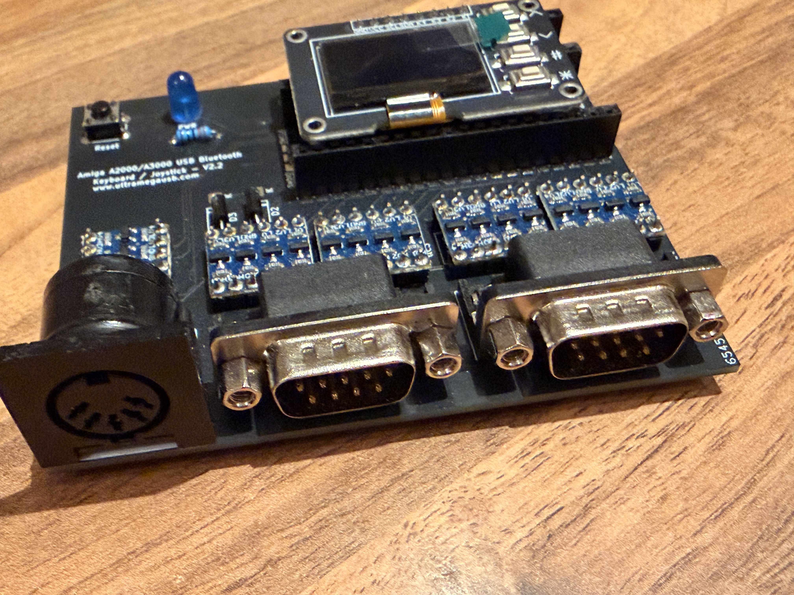

# Amiga USB & Bluetooth Adapter

## Overview

This project uses a Raspberry Pi Pico to connect modern USB and Bluetooth devices such as keyboards, mice, trackballs and gamepads to classic Amiga computers — without needing a USB stack on the Amiga itself.

The project was created so I could connect my modern peripherals with my Amiga 2000, the device has a Keyboard and 2 x Atari style Joystick connectors to interface with the Amiga.

The example adapter hardware for the project is focused on the Amiga 2000, although it can be adapted easily for other Amigas.

The adapter is bi-directional:

* **Device Mode** (default): modern USB/Bluetooth HID → Amiga keyboard, mouse, joystick, and CD32 pad signalling
* **Host Mode**: real Amiga keyboard + Port 1 mouse + Port 2 Atari stick → USB HID keyboard/mouse/gamepad on a modern PC

Joystick/CD32 pads are supported toward the Amiga in Device Mode. In Host Mode, Port 2 accepts an Atari-style two-button stick as a USB HID gamepad (Mega Drive pads deferred — see [`doc/host-mode-port2-joystick.md`](./doc/host-mode-port2-joystick.md)).

The device is connected to the Amiga using straight through cables, I am using 2 x 9 Pin DSub to Dsub and 1 x 5 Pin DIN (MIDI) cables.

On a **Pico 2 W** you can mix USB and Bluetooth devices. USB-only builds work on any Pico / Pico 2.

**This project is a fork of [amigahid-pico](https://github.com/borb/amigahid-pico)** by **just nine** (borb). That project is the foundation for Amiga keyboard and mouse signalling on the Pico. This fork builds on that work for the ultrausbt Amiga Adapter board: OLED UI, dual joystick ports, CD32 pad protocol, Bluetooth (Bluepad32), many modern USB controllers, and USB **device** mode (Amiga keyboard/mouse → PC).

Please visit and star the upstream project:  
**https://github.com/borb/amigahid-pico**

Current firmware: **v4.2.0** (`main`) · [Release notes](./RELEASE_NOTES.md) · Architecture: [`doc/architecture.md`](./doc/architecture.md) · License: [EPL-2.0](./LICENSE) · [NOTICE](./NOTICE)




## Contributions

This project is open source and I am happy to receive pull requests and issues to further improve capabilities.

## USB device support

* USB HID Keyboards
* USB HID Mice
* USB HID Gamepads / Joysticks (see below)

## Game controller support

The following USB HID gamepads / joysticks are supported (more to come):

* PlayStation 3 DualShock 3 (and third-party PS3-compatible pads: HORI, Mad Catz, Qanba, Nacon, Logitech F310, etc.)
* PlayStation 4 DualShock 4 (and third-party PS4-compatible pads)
* PlayStation 5 DualSense and DualSense Edge (USB)
* PlayStation Classic (PSC)
* Xbox XInput — Xbox 360 / One / OG (plus HID fallback)
* Nintendo Switch Pro Controller, Joy-Con (L/R/Pair/Grip), SNES Controller (NSO)
* HORI HORIPAD for Nintendo Switch
* Google Stadia Controller

Other USB HID gamepads may work via the generic path (directions + up to three buttons). Gamepads map to **Joystick Port 2** by default; Port 1 can be switched to joystick / Llamatron / CD32 mode from the OLED or keyboard shortcuts.

## Bluetooth support (Pico 2 W)

Bluetooth keyboards, mice, and gamepads are supported on the **Raspberry Pi Pico 2 W** (RP2350) via [Bluepad32](https://github.com/ricardoquesada/bluepad32). You can run a fully wireless Amiga setup, or mix USB and Bluetooth devices.

### Pairing

1. On the OLED splash screen, hold **Middle + Left** (# + Up) to enable pairing (or wait for the short post-boot pairing window).
2. Put your device into Bluetooth pairing mode.
3. Confirm the device on the OLED **Devices** / **Map Devices** screens.

To clear stored pairing keys, open the OLED **Settings** page on the screen carousel (`#` from Map Devices), select **Clear BT pair**, confirm with `#`.

To turn pairing back on after it has timed out or been turned off: **Settings → Pair ON** (or **Middle + Left** / # + Up on Splash).

**Note:** Bluetooth support is intended for Pico 2 W. Prefer Pico 2 W for wireless builds.

# Usage

## USB

Connect devices to the Pico USB port (use a powered USB OTG hub if you need multiple devices). Supported keyboards, mice, and gamepads should enumerate within a few seconds; confirm on the OLED. If you find a modern device that does not work, open an issue.

## Bluetooth

See **Bluetooth support** above. Pairing is controlled from the OLED splash screen. Keyboard shortcuts work the same on USB and Bluetooth keyboards.

## Keyboard shortcuts

The adapter uses a number of Keyboard shortcut key combinations to toggle features.

These combos are handled by the adapter (USB **and** Bluetooth keyboards) and are **not** passed through to the Amiga. **Left Amiga** = Left Command / Left GUI / Left Windows on PC/Mac keyboards.

| Shortcut | Function |
|----------|----------|
| **Ctrl + Left Amiga + Right Amiga** | Amiga hard reset (classic) |
| **Ctrl + Left Amiga + Backspace** | Amiga hard reset (alternate for keyboards without Right Amiga/GUI) |
| **Shift + Left Amiga + J** | Toggle Port 1 between Amiga mouse and joystick |
| **Shift + Left Amiga + L** | Toggle Llamatron / Robotron style twin-stick mode (Port 2 move + Port 1 aim) |
| **Shift + Left Amiga + C** | Toggle Port 2 CD32 seven-button pad mode |

Port 1 full cycle (Ami Ms → Joy → CD32 → Llama → Atr Ms) is on the OLED **Left** button. Reset is signalled by holding the Amiga keyboard **CLOCK** line low (as a real Amiga keyboard MCU does), with a minimum hold time so it still works when a keyboard drops a combo key from its HID report.

Optional: remap one HID scancode to Amiga **Help** via `KEY_REMAP_HID_TO_HELP` in `src/config.h` (default: Logitech MX `| / ~ #` key). Set to `0` to disable. This is useful for mapping the quit key in WHDload.

### Llamatron dual-stick mode

**Shift + Left Amiga + L** enables Llamatron / twin-stick style routing (one dual-stick gamepad shared across ports: left stick → Port 2 move, right stick → Port 1 aim). Works with **Port 2 CD32** on; mutually exclusive with **Port 1 CD32**. See the OLED Port 1 mode label (**Llama**).

### CD32 seven-button mode

**CD32 pad emulation is complete and working** on both ports:

* **Port 2:** **Shift + Left Amiga + C**, or OLED **Right** (Joy ↔ CD32)
* **Port 1:** OLED **Left** cycle to **CD32** (Ami Ms → Joy → CD32 → Llama → Atr Ms)

Uses the Amiga CD32 serial pad protocol (seven buttons + D-pad). Compatible with Llamatron on Port 2 CD32; exclusive with Port 1 CD32. Protocol detail: [`doc/archive/CD32_BUILD_SPEC.md`](./doc/archive/CD32_BUILD_SPEC.md).

# OLED UI

An SSD1306 OLED and three buttons are supported on the ultrausbt Amiga board (optional for a bare Pico, but recommended). On modules with **Up / Down / #** keys: **Up** = Left, **Down** = Right, **#** = Middle.

The UI is a **screen carousel**: press **#** to advance pages (wraps to Splash).

| Mode | Carousel sequence |
|------|-------------------|
| **Device Mode** (USB/BT → Amiga) | Splash → Devices → Map Devices → Settings → Splash |
| **Host Mode** (Amiga kbd/mouse → PC) | Splash → Settings → Splash (Devices / Map Devices hidden) |

| Control | Action |
|---------|--------|
| **Left** (Up) | Splash/Devices: cycle Port 1 (Ami Ms → Joy → CD32 → Llama → Atr Ms). Settings: move cursor up |
| **Right** (Down) | Splash/Devices: cycle Port 2 (Joy ↔ CD32). Settings: move cursor down |
| **Middle** (#) | Advance screen carousel; on Settings: confirm selection |
| **Middle + Left** (# + Up) | Toggle Bluetooth pairing (Splash) |
| **Settings → Clear BT pair** | Clear stored Bluetooth pairing keys (`#` then confirm) |
| **Settings → Pair ON / Pair OFF** | Enable or disable Bluetooth pairing (label is the target state) |
| **Settings → Host Mode / Device Mode** | Switch to that role (`#` saves and reboots); label is the target, not current |
| **Settings → Back** | Return to Splash (default selection) |

Splash shows **Device Mode**, both ports in large type (`1:Ami Ms` / `2:Joy`), pairing status bottom-left, and firmware version bottom-right. **Ami Ms** = Amiga mouse, **Atr Ms** = Atari ST mouse pinout on Port 1.

OLED UX conventions (carousel, in-page select, confirms): [`doc/archive/oled-ui-style-guide.md`](./doc/archive/oled-ui-style-guide.md).

# USB Host Mode (Amiga keyboard / mouse / Port 2 stick on a PC)

The adapter can run in reverse: read a real Amiga keyboard (KCLK/KDAT), Port 1 mouse, and an **Atari-style two-button joystick on Port 2**, and present itself to a host PC (or MiSTer) as a composite USB HID keyboard + mouse + gamepad.

* Toggle from the OLED **Settings** carousel page (**Host Mode** / **Device Mode**); the board saves the role and reboots.
* In Host Mode the carousel is Splash ↔ Settings only.
* Port 2: straight DB-9 cable; directions + fire (pin 6) + button 2 (pin 9). No remapper needed for Atari sticks.
* Protocol and diagnostics: [`doc/archive/amiga-usb-device-mode.md`](./doc/archive/amiga-usb-device-mode.md). Research / future Mega Drive: [`doc/host-mode-port2-joystick.md`](./doc/host-mode-port2-joystick.md).

# Hardware

Note: The hardware adapter for this project is unique to this repo; the GPIOs differ from the original amigahid-pico adapters by nine/borb.

The [`kicad/`](./kicad/) directory includes an **Amiga 2000** reference board design and manufacturing gerbers (**Amiga 2000 Adapter v2.4**, `amiga-generic-dsub.*` + [`kicad/gerbers/`](./kicad/gerbers/)). More board designs will follow.

Firmware board maps:

* **Rev 5** — level-shifted Amiga I/O (`HIDPICO_REVISION=5` in root `CMakeLists.txt`)
* **Rev 6** — direct 5V-tolerant I/O on Pico 2 / Pico 2 W; Port 2 fire/B2/B3 on GPIO 16/17/18; OLED buttons on ADC 26/27/28 — see [`doc/gpio_rev6_adc_avoidance.md`](./doc/gpio_rev6_adc_avoidance.md)

Historical upstream PCB notes/errata (amigahid-pico / borb) remain in [`doc/archive/borb-amigahid-hardware.md`](./doc/archive/borb-amigahid-hardware.md) and [`doc/archive/borb-amigahid-errata.md`](./doc/archive/borb-amigahid-errata.md).

# Building the firmware

The firmware can either be downloaded pre built from the Releases section, or you can build yourself with the 'build-all.sh' script. 

```bash
# Default: Pico 2 W → dist/
./build-all.sh

# Incremental rebuild
CLEAN_BUILD_DIRS=0 ./build-all.sh

# Multiple boards
BUILD_BOARDS=pico,pico2_w ./build.sh
BUILD_BOARDS=all ./build-all.sh
```

Flash the matching `.uf2` from `dist/` (hold **BOOTSEL**, copy to the RPI-RP2 drive).

Board revision is set in the root `CMakeLists.txt` (`HIDPICO_REVISION=5` or `6`).

By default the serial console shows boot info and device connect/disconnect messages. For verbose dumps, uncomment `DEBUG_MESSAGES=1` in `CMakeLists.txt`, or set `CONTROLLER_DEBUG` / `KEYBOARD_IN_DEBUG` in `src/config.h`.

# Documentation

Index: [`doc/README.md`](./doc/README.md)

| Doc | Topic |
|-----|--------|
| [`RELEASE_NOTES.md`](./RELEASE_NOTES.md) | Firmware changelog |
| [`doc/architecture.md`](./doc/architecture.md) | Architecture + developer/agent quickstart |
| [`doc/future_work.md`](./doc/future_work.md) | Known limitations / roadmap |
| [`doc/gpio_rev6_adc_avoidance.md`](./doc/gpio_rev6_adc_avoidance.md) | Rev 6 pin rationale |
| [`doc/BT_PAIRING_BEST_PRACTICES.md`](./doc/BT_PAIRING_BEST_PRACTICES.md) | Bluetooth pairing |
| [`doc/archive/`](./doc/archive/) | Detailed / historical notes |

# Acknowledgements

**Upstream — please support the original project:**

* **[amigahid-pico](https://github.com/borb/amigahid-pico)** by **just nine** \<[nine@aphlor.org](mailto:nine@aphlor.org)\> — the original Amiga HID-on-Pico work this firmware forks and extends. Without that project this adapter would not exist.

The “ultrausbt” / ultramegausb name is tongue-in-cheek and highlights the capabilities made possible by TinyUSB, Bluepad32, and the Pico ecosystem.

This fork also relies on:

* [Raspberry Pi Pico SDK](https://github.com/raspberrypi/pico-sdk) — RP2040 / RP2350 platform
* [TinyUSB](https://github.com/hathach/tinyusb) by Ha Thach — USB host and device stacks
* [Bluepad32](https://github.com/ricardoquesada/bluepad32) by Ricardo Quesada — Bluetooth HID gamepads, keyboards, and mice
* [BTstack](https://github.com/bluekitchen/btstack) (via Pico SDK / Bluepad32) — Bluetooth controller stack
* [pico-ssd1306](https://github.com/daschr/pico-ssd1306) by David Schramm — OLED display driver
* [tusb_xinput](https://github.com/Ryzee119/tusb_xinput) by Ryzee119 — Xbox XInput host path for TinyUSB
* CD32 protocol analysis via [PSCD32 Development Diary](https://www.mrdictionary.net/PSCD32/diary/2019_08_09.htm) (Mathew Carr) and related pad schematics

**Other Projects**
I also have a number of other Retro Computer adapter projects:
[Atari Mega ST/TT IKBD - USB/BT Adapater](https://github.com/trickydee/ultramegausb-atari-st-rpikbd).
[Apple ADB - USB/BT Adapater](https://github.com/trickydee/TBC).
[PC XT / AT / PS2 - USB/BT Adapater](https://github.com/trickydee/TBC).


**This ultrausbt Amiga fork** is maintained by [trickydee](https://github.com/trickydee) ([ultrausbt-amiga](https://github.com/trickydee/ultrausbt-amiga)). A large portion of the code and documentation was developed with [Cursor](https://cursor.com) and supporting LLMs — this project would not exist in its current form without those tools, on top of the open-source foundations above.
