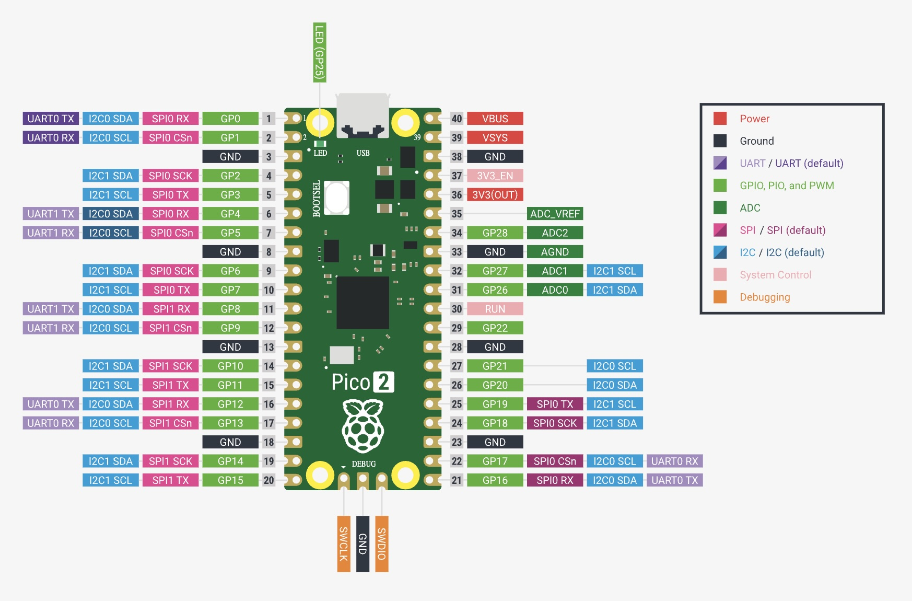
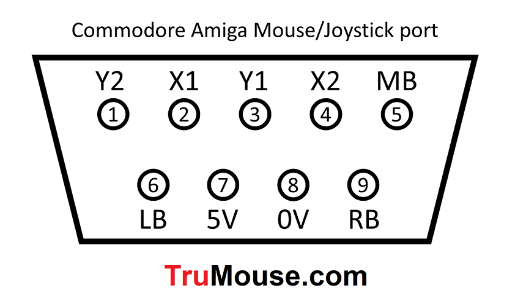

# Amiga Code GPIO Mappings for Atari Board (Revision 5)

This document details all GPIO pin mappings for the Amiga firmware when running on the Atari board hardware (Revision 5).

**IMPORTANT:** All pin designations are GPIO PIN NUMBERS, NOT PHYSICAL PIN NUMBERS.

## GPIO Usage Summary

### Keyboard Interface (GPIO 4-6)
All keyboard GPIOs are configured as **OUTPUT** (active low).

| GPIO | Function | Signal Name | Direction | Notes |
|------|----------|-------------|-----------|-------|
| 4 | Keyboard Reset | `KBD_AMIGA_RST` | OUTPUT | Active low |
| 5 | Keyboard Data | `KBD_AMIGA_DAT` | OUTPUT | Active low, serial data |
| 6 | Keyboard Clock | `KBD_AMIGA_CLK` | OUTPUT | Active low, serial clock |

**Status:** ✅ No conflicts

---

### I2C Display Interface (GPIO 8-9)
I2C pins use special function mode (not standard GPIO_IN/GPIO_OUT).

| GPIO | Function | Signal Name | Direction | Notes |
|------|----------|-------------|-----------|-------|
| 8 | I2C SDA | `I2C_PIN_SDA` / `SSD1306_SDA` | I2C Function | Pull-up enabled |
| 9 | I2C SCL | `I2C_PIN_SCL` / `SSD1306_SCL` | I2C Function | Pull-up enabled |

**Status:** ✅ No conflicts (shared I2C bus for display)

---

### Joystick Port 1 / Mouse Interface (GPIO 10-14, 2-3)

Port 1 shares GPIOs with the mouse interface. All signals are **OUTPUT** (active low).

| GPIO | DB-9 Pin | Cable Color | Function | Signal Name | Direction | Notes |
|------|----------|-------------|----------|-------------|-----------|-------|
| 10 | 1 | Blue | Port 1 UP / Mouse V | `QM1_AMIGA_V` | OUTPUT | Active low |
| 11 | 2 | Yellow | Port 1 DOWN / Mouse H | `QM1_AMIGA_H` | OUTPUT | Active low |
| 12 | 3 | Red | Port 1 LEFT / Mouse VQ | `QM1_AMIGA_VQ` | OUTPUT | Active low |
| 13 | 4 | Orange | Port 1 RIGHT / Mouse HQ | `QM1_AMIGA_HQ` | OUTPUT | Active low |
| 3 | 5 | Purple | Port 1 Button 3 | `QM1_AMIGA_B3` | OUTPUT | Active low, remapped from GPIO 13 |
| 14 | 6 | Green | Port 1 FIRE / Mouse B1 | `QM1_AMIGA_B1` | OUTPUT | Active low |
| - | 7 | - | +5V | - | - | Power supply |
| - | 8 | White | GND | - | - | Ground |
| 2 | 9 | Grey | Port 1 Button 2 | `QM1_AMIGA_B2` | OUTPUT | Active low, remapped from GPIO 12 |

**Status:** ✅ No conflicts (buttons remapped to GPIO 2 and 3)

---

### Display UI Buttons (GPIO 16-18)
All display buttons are configured as **INPUT** with pull-up resistors.

| GPIO | Function | Signal Name | Direction | Notes |
|------|----------|-------------|-----------|-------|
| 16 | Right Button | `GPIO_BUTTON_RIGHT` | INPUT | Pull-up, active low |
| 17 | Middle Button | `GPIO_BUTTON_MIDDLE` | INPUT | Pull-up, active low |
| 18 | Left Button | `GPIO_BUTTON_LEFT` | INPUT | Pull-up, active low |

**Status:** ✅ No conflicts

---

### Joystick Port 2 (GPIO 19-22, 26-28)
All Port 2 signals are configured as **OUTPUT** (active low).

| GPIO | DB-9 Pin | Cable Color | Function | Signal Name | Direction | Notes |
|------|----------|-------------|----------|-------------|-----------|-------|
| 19 | 1 | Blue | Port 2 UP | `QM2_AMIGA_V` | OUTPUT | Active low |
| 20 | 2 | Yellow | Port 2 DOWN | `QM2_AMIGA_H` | OUTPUT | Active low |
| 21 | 3 | Red | Port 2 LEFT | `QM2_AMIGA_VQ` | OUTPUT | Active low |
| 22 | 4 | Orange | Port 2 RIGHT | `QM2_AMIGA_HQ` | OUTPUT | Active low |
| 28 | 5 | Purple | Port 2 Button 3 | `QM2_AMIGA_B3` | OUTPUT | Active low, remapped from GPIO 18 |
| 26 | 6 | Green | Port 2 FIRE | `QM2_AMIGA_B1` | OUTPUT | Active low |
| - | 7 | - | +5V | - | - | Power supply |
| - | 8 | White | GND | - | - | Ground |
| 27 | 9 | Grey | Port 2 Button 2 | `QM2_AMIGA_B2` | OUTPUT | Active low, remapped from GPIO 19 |

**Status:** ✅ No conflicts (buttons remapped to GPIO 27 and 28)

---

## Complete GPIO Usage Matrix

| GPIO | DB-9 Pin | Cable Color | Function | Signal Name | Direction | Status |
|------|----------|-------------|----------|-------------|-----------|--------|
| 0 | - | - | Unused | - | - | ✅ Free |
| 1 | - | - | Unused | - | - | ✅ Free |
| 2 | P1:9 | Grey | Port 1 Button 2 | `QM1_AMIGA_B2` | OUTPUT | ✅ OK |
| 3 | P1:5 | Purple | Port 1 Button 3 | `QM1_AMIGA_B3` | OUTPUT | ✅ OK |
| 4 | - | - | Keyboard RST | `KBD_AMIGA_RST` | OUTPUT | ✅ OK |
| 5 | - | - | Keyboard DAT | `KBD_AMIGA_DAT` | OUTPUT | ✅ OK |
| 6 | - | - | Keyboard CLK | `KBD_AMIGA_CLK` | OUTPUT | ✅ OK |
| 7 | - | - | Unused | - | - | ✅ Free |
| 8 | - | - | I2C SDA | `I2C_PIN_SDA` / `SSD1306_SDA` | I2C Function | ✅ OK |
| 9 | - | - | I2C SCL | `I2C_PIN_SCL` / `SSD1306_SCL` | I2C Function | ✅ OK |
| 10 | P1:1 | Blue | Port 1 UP | `QM1_AMIGA_V` | OUTPUT | ✅ OK |
| 11 | P1:2 | Yellow | Port 1 DOWN | `QM1_AMIGA_H` | OUTPUT | ✅ OK |
| 12 | P1:3 | Red | Port 1 LEFT | `QM1_AMIGA_VQ` | OUTPUT | ✅ OK |
| 13 | P1:4 | Orange | Port 1 RIGHT | `QM1_AMIGA_HQ` | OUTPUT | ✅ OK |
| 14 | P1:6 | Green | Port 1 FIRE | `QM1_AMIGA_B1` | OUTPUT | ✅ OK |
| 15 | - | - | Unused | - | - | ✅ Free |
| 16 | - | - | Display Right Button | `GPIO_BUTTON_RIGHT` | INPUT | ✅ OK |
| 17 | - | - | Display Middle Button | `GPIO_BUTTON_MIDDLE` | INPUT | ✅ OK |
| 18 | - | - | Display Left Button | `GPIO_BUTTON_LEFT` | INPUT | ✅ OK |
| 19 | P2:1 | Blue | Port 2 UP | `QM2_AMIGA_V` | OUTPUT | ✅ OK |
| 20 | P2:2 | Yellow | Port 2 DOWN | `QM2_AMIGA_H` | OUTPUT | ✅ OK |
| 21 | P2:3 | Red | Port 2 LEFT | `QM2_AMIGA_VQ` | OUTPUT | ✅ OK |
| 22 | P2:4 | Orange | Port 2 RIGHT | `QM2_AMIGA_HQ` | OUTPUT | ✅ OK |
| 23 | - | - | Unused | - | - | ✅ Free |
| 24 | - | - | Unused | - | - | ✅ Free |
| 25 | - | - | Onboard LED | `PICO_DEFAULT_LED_PIN` | OUTPUT | ✅ OK |
| 26 | P2:6 | Green | Port 2 FIRE | `QM2_AMIGA_B1` | OUTPUT | ✅ OK |
| 27 | P2:9 | Grey | Port 2 Button 2 | `QM2_AMIGA_B2` | OUTPUT | ✅ OK |
| 28 | P2:5 | Purple | Port 2 Button 3 | `QM2_AMIGA_B3` | OUTPUT | ✅ OK |
| 29 | - | - | Unused | - | - | ✅ Free (ADC3) |

**Summary:** ✅ **All GPIO conflicts resolved** - No conflicts detected

---

## Button Remapping Summary

The following buttons have been remapped in hardware to resolve GPIO conflicts:

### Port 1 Buttons
- **Button 2** (`QM1_AMIGA_B2`): **GPIO 12 → GPIO 2** ✅
  - **Reason:** GPIO 12 conflicted with LEFT direction (`QM1_AMIGA_VQ`)
  - **Status:** Remapped and working

- **Button 3** (`QM1_AMIGA_B3`): **GPIO 13 → GPIO 3** ✅
  - **Reason:** GPIO 13 conflicted with RIGHT direction (`QM1_AMIGA_HQ`)
  - **Status:** Remapped and working

### Port 2 Buttons
- **Button 2** (`QM2_AMIGA_B2`): **GPIO 19 → GPIO 27** ✅
  - **Reason:** GPIO 19 conflicted with UP direction (`QM2_AMIGA_V`)
  - **Status:** Remapped and working

- **Button 3** (`QM2_AMIGA_B3`): **GPIO 18 → GPIO 28** ✅
  - **Reason:** GPIO 18 conflicted with Display Left Button (`GPIO_BUTTON_LEFT`) - INPUT vs OUTPUT conflict
  - **Status:** Remapped and working

---

## Software Changes

### Removed Workarounds
The following software workarounds have been **removed** as they are no longer needed:

1. **Port 1 Button 2/3 Conditional Logic** (removed from `joystick_port1.c`)
   - Previously: Buttons only worked in mouse mode
   - Now: Buttons work in both mouse and joystick modes

2. **Port 2 Button 3 Disabled** (removed from `joystick_port2.c` and `usb_hid.c`)
   - Previously: Button 3 was commented out/disabled
   - Now: Button 3 is fully functional

### Code Updates
- `src/config.h`: Updated GPIO definitions for all remapped buttons
- `src/platform/amiga/joystick_port1.c`: Removed conditional button logic
- `src/platform/amiga/joystick_port2.c`: Re-enabled Button 3 handling
- `src/usb_hid.c`: Re-enabled Button 3 mapping for USB and Bluetooth gamepads

---

## Atari Board Compatibility Notes

This GPIO mapping is designed for the Atari board hardware, which uses:
- **I2C Display:** GPIO 8/9 on `i2c0` (matches Atari)
- **Joystick Port 1:** GPIO 10-14 (matches Atari JOY1)
- **Joystick Port 2:** GPIO 19-22, 26 (matches Atari JOY0)
- **Display Buttons:** GPIO 16-18 (matches Atari)
- **Additional Buttons:** GPIO 2, 3, 27, 28 (Amiga-specific, no Atari conflicts)

The firmware is designed to be compatible with both Amiga and Atari firmware on the same hardware board.

---

## Free GPIOs Available

The following GPIOs are currently unused and available for future expansion:

| GPIO | Status | Notes |
|------|--------|-------|
| 0 | Free | Available |
| 1 | Free | Available |
| 7 | Free | Available |
| 15 | Free | Available |
| 23 | Free | Available |
| 24 | Free | Available |
| 29 | Free | Available (ADC3) |

---

## Version History

- **v1.0.5**: Remapped all joystick buttons to resolve GPIO conflicts
  - Port 1 Button 2: GPIO 12 → GPIO 2
  - Port 1 Button 3: GPIO 13 → GPIO 3
  - Port 2 Button 2: GPIO 19 → GPIO 27
  - Port 2 Button 3: GPIO 18 → GPIO 28
- **v1.0.4**: Fixed GPIO 18 conflict (Port 2 Button 3 vs Display Left Button) by disabling Button 3
- **v1.0.3**: Fixed Port 1 LEFT/RIGHT movement issues (GPIO direction conflicts)
- **Initial**: Identified GPIO conflicts during Atari board port

---

## References

- `src/config.h`: GPIO pin definitions
- `src/platform/amiga/joystick_port1.c`: Port 1 implementation
- `src/platform/amiga/joystick_port2.c`: Port 2 implementation
- `src/display/display.c`: Display button GPIO configuration
- `doc/gpio-fixes-todo.md`: Previous conflict documentation
